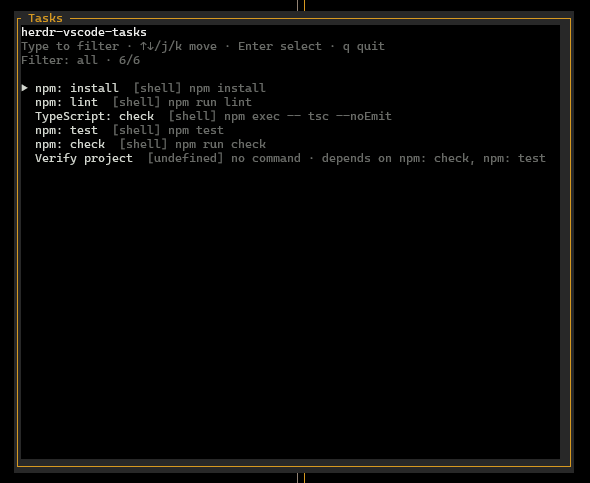
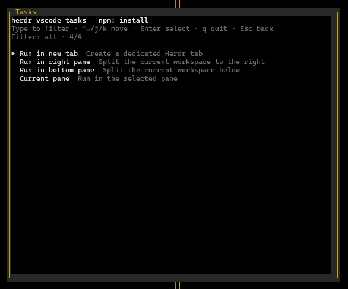

```bash
herdr plugin install lurepos/herdr-vscode-tasks
herdr plugin list

herdr plugin uninstall herdr.vscode-tasks
```

```bash
nano ~/.config/herdr/config.toml
herdr server reload-config
```

```toml
[[keys.command]]
key = "f1"
type = "plugin_action"
command = "herdr.vscode-tasks.open-picker"
description = "Abrir tareas de VS Code"
```




